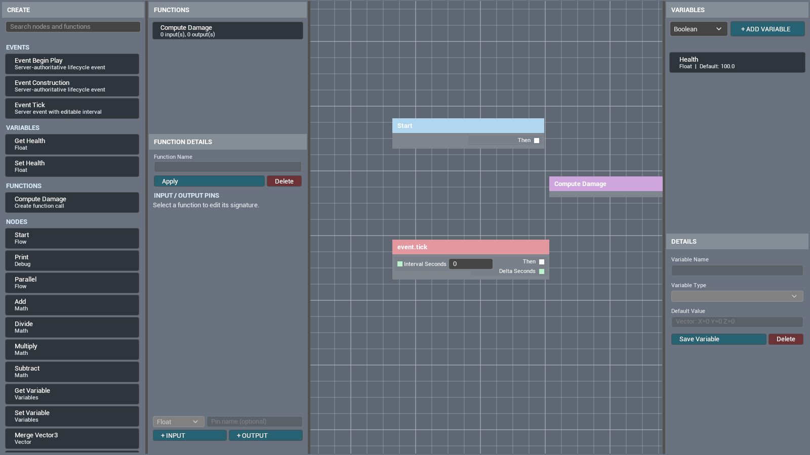
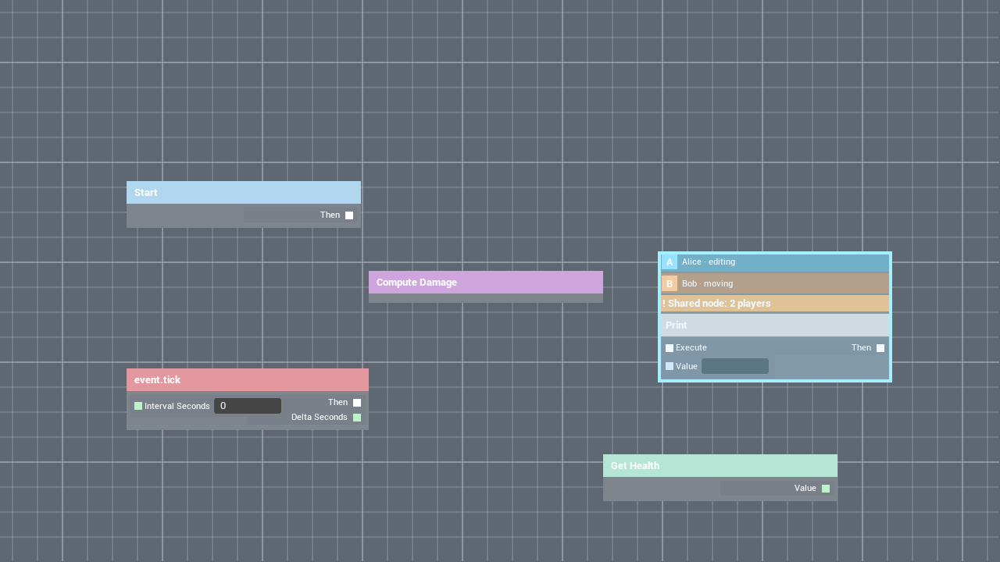

# CBP 3.0 User Guide (0.5.14)

This guide targets UE 5.5. The plugin lives in `Plugins/CustomBlueprintRuntime`.

## 1. Minimal setup

1. Add a `Custom Blueprint Runtime` component to the Actor that owns the graph.
2. Enable replication on that Actor. The component also ensures this on the authority.
3. Create a Widget Blueprint derived from `CBPGraphEditorWidget`.
4. After creating the widget, call `Initialize Editor From Actor` with the graph-owning Actor.
5. Add it to the viewport and configure input mode/mouse visibility for your game.

For a freely arranged UI, place `CBPGraphWidget`, `CBPCreatePanel`,
`CBPVariableDetailsPanel`, and `CBPFunctionDetailsPanel` independently, then call
`Initialize Independent Editor Panels From Actor` once. Every panel has its own
`Appearance` settings. A complete custom skin can derive from a panel and disable
`Use Built-in Layout`.

The top bar is also independent: place `CBPGraphToolbarPanel` anywhere and call
`Initialize Toolbar` with the initialized graph widget. `RUN` validates and
starts a server-authoritative run session, `STOP` ends the complete session and
restores pre-run runtime state, `SAVE` writes the editable slot name through
the authoritative save path, and `LOAD` restores and replicates the same slot.
Loading while running stops and restores the active session first. The separate `COMPILE` button was removed because
this graph is interpreted and Run already performs validation.

To initialize only the function panel, call the new `Initialize Function Panel`
with an already initialized `CBPGraphWidget`. It resolves the same runtime
component automatically, so no manual Get Component node is required. The
`Initialize Function Panel From Actor` convenience is also available.

## 2. Nodes and variables

- Normal Create-panel entries honor `Graph Style > Available Nodes`; `Use All Registered Nodes`
  includes everything. New or edited node DataAssets are rescanned without restarting the editor.
- Choose a type and press `+ ADD VARIABLE`, then enter a name/default and press `Save Variable`.
- The Create panel automatically adds typed `Get Name` and `Set Name` entries for every saved variable.
- New nodes use the last graph pointer/context-menu coordinate, or the view center before pointer input.
- A custom context menu can call `Set Node Spawn Graph Position` before a create action.
- Right-button drag still pans the canvas. Only a right click without movement emits the unified `On Graph Pointer Context`; no menu opens automatically.
- Switch on `Context`: call `Open Create Node Menu` for Canvas, `Open Node Context Menu` for Node, and `Open Pin Context Menu` for Pin.
- The node menu deletes/collapses/disconnects selected nodes. The pin menu breaks the selected pin or every link on its node. All menus use compact, work-area-bounded sizing.
- Bind `On Graph Menu Item Selected` to receive the selected action type, node/pin ID, variable/function source ID, created node/function ID, graph position, and success state.
- Pin context clicks and connection drops use a 16 px radius around the visible socket by default. Dropping on a node body automatically chooses its nearest direction/type-compatible pin. When multiple nodes are selected, right-clicking a selected node's pin reports Node context and preserves the multi-selection.
- Wire dragging uses the current pointer-event geometry instead of previous-frame cached geometry. Stable node/pin IDs keep the drag alive if a collaboration refresh temporarily transfers mouse capture.

Variable edits are committed only by `Save Variable`. Name, type, and default value are server-authoritative and replicated. If the live value still equals the old default, changing the default updates both.

## 3. Collapse to function

Collapsing is an explicit graph action:

1. Select non-entry nodes in the graph.
2. Call `Collapse Selection To Function` from your context menu, shortcut, or button.
3. Supply a function name. The selected subgraph moves into replicated function storage and a call node replaces it.
4. Select the function in the Functions panel, rename it, and add any number of interface pins with `+ INPUT` / `+ OUTPUT`.
5. Double-click either a function call node or its Functions-panel row to switch the current `CBPGraphWidget` to that function canvas. Body-node creation, movement, deletion, defaults, and links are server-authoritative. Call `Return To Main Graph` to return. Disable `Switch Main Graph On Double Click` to retain separate-window/custom hosting options.

Stable interface IDs update all existing call nodes. Each function canvas has one `Function Entry` node containing every public input and one `Return` node containing every public output, matching UE's function layout. Old per-pin boundary nodes are merged on authority load. Unwired inputs/outputs preserve defaults, and boundary nodes are safely bypassed during execution expansion. Entry events and existing function calls cannot be collapsed again, preventing recursive definitions.

## 4. Prebuilt events

- `Event Construction`: runs once first on the authority after `RUN`.
- `Event Begin Play`: runs once after Construction completes, even without a Tick event.
- `Event Tick`: authority-only scheduling starts after Begin Play completes. `Interval Seconds = 0` means every server frame; a positive value is the interval in seconds. `Delta Seconds` reports time since that Tick node last fired.

None of these events run automatically with Actor/component BeginPlay. `STOP`
cancels all active node work and Tick scheduling, clears node/wire visuals, and
restores variable values captured before Run. Generic external side effects such
as spawned Actors, network requests, or files require node-specific undo logic.

Only connections whose downstream node actually consumes an execution token
animate; unrelated wires remain static. Remapped function-boundary pins are
resolved to the current visible Exec wire before animation. No GraphStyle setup is
required. The default cyan pulse remains visible for about 1.25 seconds, while Stop clears
them immediately.

Only one entry of each type is allowed per graph.

## 5. Collaboration and conflicts

`Enable Collaboration Presence` is on by default. Selection, pin editing, node movement, and connection gestures publish presence through the authority to other clients.

- Set `Local Player Avatar` for a portrait; otherwise a colored initial is shown.
- Leave `Local Player Presence Color` alpha at zero for a deterministic automatic color.
- Selected nodes use a 4 px bright cyan outline plus fill. Customize `Selection Outline Color`, `Selection Fill Color`, and `Selection Outline Thickness` in a `CBPNodeWidget` subclass.
- Shared nodes list every player and the `editing`, `moving`, or `connecting` activity, plus an orange warning strip.
- Collaboration rows extend upward from the saved node coordinate, so presence never shifts the node body.
- The variable details panel lists players editing the selected variable and highlights shared editing.
- Bind `On Collaboration Conflict` for an additional toast, sound, or confirmation UI.

After creating the local graph widget, call `Set Local Player Collaboration Profile` once per player with the desired display name, avatar texture, and color. The equivalent component function is `Set Local Collaboration Profile`. Profiles replicate through the authority but are not saved in graph snapshots.

The warning is advisory, not a hard distributed lock. The server validates and orders every mutation, and the last accepted mutation is authoritative. Override `Can Remote Player Edit` for hard team, distance, role, or ownership rules.

## 6. Networking

The persistent edit path is:

`Graph widget -> target CBP component -> owned player gateway -> server -> FastArray -> all clients`

The plugin creates an edit gateway on each PlayerController. Early client commands are queued until it is available. Graphs, variables, functions, and function bodies use FastArray state replication, so late joiners receive the complete current state.

A multi-node drag sends one batched `Move Nodes` request and increments graph revision once. Presence is also FastArray-delta replicated, and only nodes whose collaboration-state hash changed are rebuilt.

For PIE verification, use at least two players with Listen Server. Open the same graph in both windows, select the same node, then move or edit it in one window. Both windows should show the player rows and shared-node warning.

## 7. Saving

Call these on the target `CBPRuntimeComponent`:

- `Save Graph To Slot(SlotName, UserIndex)`
- `Load Graph From Slot(SlotName, UserIndex)`
- `Does Graph Save Exist`
- `Export Graph Save Data` / `Import Graph Save Data`

Client requests are forwarded through the owned gateway and executed on the server. Snapshots contain nodes, links, variable definitions/live values, function bodies, and signatures. Selection, avatars, and conflicts are ephemeral presence and are not saved.

## 8. Release checklist

- Keep server permission checks in Shipping and override `Can Remote Player Edit` for project policy.
- Configure graph-Actor relevancy instead of replicating the editor to unrelated players.
- Use categories, search, and node whitelists for large registries.
- Test save/load, function signatures, variable renames, and Tick intervals on both listen and dedicated servers.

The 0.5.14 workspace automation covers explicit run sessions, Construction/Begin Play/Tick ordering, Stop state restoration, animation emitted when execution tokens are actually consumed, reliable multiplayer execution-visualization delivery, dual-path connection-layer frame refresh, visible Exec-wire resolution, traversed-wire-only animation, toolbar Save/Load, safe load while running, live node-DataAsset refresh, graph node whitelists, arbitrary function interfaces, combined entry/return nodes, authoritative function-body edits, batched positions, conflicts, variable-edit presence, and custom player profiles. Packaging isolation is intentionally deferred during this development stage.
